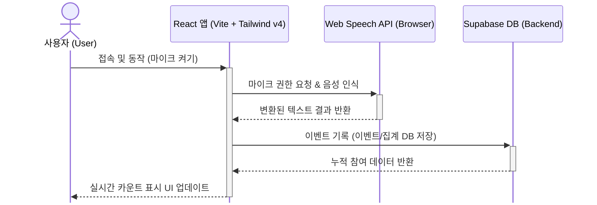
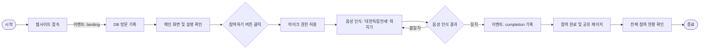

# 🇰🇷 3.1 운동 (March 1st Movement)


> **Speech-to-text(STT)를 활용한 온라인 3.1 운동 기념 웹 프로젝트입니다.**

>**Online movement day website using Speech-to-text** 

## 프로젝트 기간 (Project Duration)
2026.03.01 ~ 2026.03.02 


## 🛠️ 기술 스택(Tech Stack)

- **기획(Planning):** Gemini
- **디자인(Design):** Nano banana
- **UI/UX:** Figma
- **개발(Development):** Figma Make, Antigravity
- **배포(Deployment)** Vercel 
- **DB** Supabase 
- **STT** Web Speech API 

## 📂 프로젝트 구조 (Project Structure)

```text
movement/
├── public/                 # 정적 자산 (이미지, 파비콘 등)
├── src/                    # 주요 소스 코드
│   ├── app/                # 애플리케이션 핵심 로직
│   │   ├── components/     # UI 구성 요소 (버튼, 모달, 레이아웃 등)
│   │   └── App.tsx         # 메인 앱 컴포넌트
│   ├── imports/            # 페이지 단위 컴포넌트 (IndependenceDayCelebrationPage 등)
│   ├── lib/                # 외부 서비스 설정 (supabase.ts 등)
│   ├── styles/             # CSS 스타일 파일 (Tailwind, 테마, 폰트)
│   ├── main.tsx            # React 진입점 (DOM 렌더링)
│   └── vite-env.d.ts       # Vite 관련 타입 정의
├── index.html              # HTML 템플릿
├── vite.config.ts          # Vite 빌드 및 플러그인 설정
├── tsconfig.json           # TypeScript 기본 설정
└── tsconfig.node.json      # Node.js 환경용 TypeScript 설정 (Vite 설정 파일용)
```

## 📈 서비스 및 사용자 흐름 (Service & User Flow)

### Service Architecture ⚙️


### User Journey 🗺️


---

## 🚀 Links

- **🔗 사이트 바로 보기:(Go to Website)** [온라인 3.1 운동 웹사이트](https://19190301-movement-day.vercel.app/)
- **📝 회고 및 기록 보기(Go to Notion):** 
- [노션 회고록 KOR](https://flint-august-530.notion.site/3-1-316a565913a480d8bab8f874475e8305?source=copy_link)
[Notion in Eng]() 

